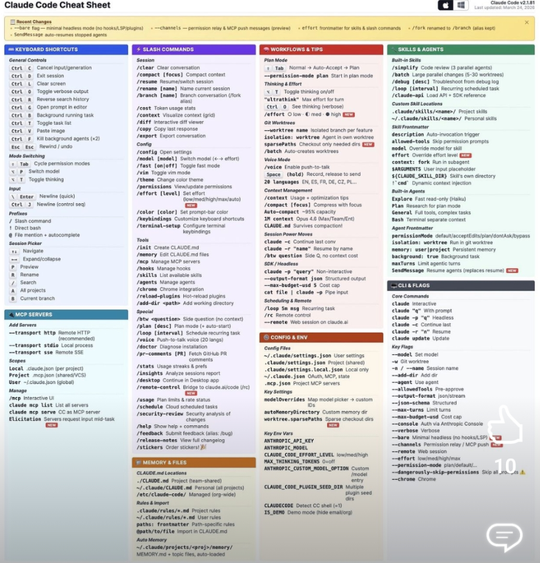
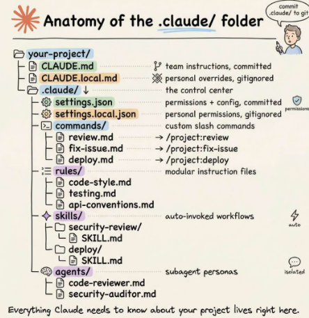

# dot-claude-playground

A workspace and laboratory for experimenting with, developing, and managing **Agent Skills** across AI assistants (Claude Code, Antigravity, and other Agent Skills-compatible tools).




---

## Directory & Compatibility Mapping

Different agent environments discover skills from specific standard locations. Keep this structure in mind when adding or syncing skills:

```text
dot-claude-playground/
|-- .claude/skills/             # Claude Code workspace skills
|   |-- bdd-skill-testing/
|   |-- cv-polish/
|   |-- data-analyzer/
|   \-- ...
|-- .agents/skills/             # Antigravity & Agentic standard workspace skills
|   |-- show-me/
|   \-- bro/
\-- ~/.gemini/config/skills/    # Antigravity Global skills (C:\Users\HP\.gemini\config\skills)
```

---

## Skills Setup & Installation

### 1. Install via Skills CLI (`npx skills`)

Install community skills directly from GitHub repositories:

```bash
# Install the 'show-me' visual diagram skill
npx -y skills add humanlayer/skills --skill show-me

# Install the 'find-skills' registry discovery skill
npx -y skills add vercel-labs/skills --skill find-skills
```

### 2. Install from Git / Source (e.g. `bro-skill`)

For skills hosted in standalone repositories:

```bash
# Clone and run the installer
git clone https://github.com/luchasarie/bro-skill.git
cd bro-skill
./install.sh          # installs into every detected tool
./install.sh --all    # force-install into every supported tool
```

Or install directly via CLI or PowerShell:

```powershell
# Using npx skills CLI
npx -y skills add luchasarie/bro-skill --skill bro

# Or download SKILL.md directly
New-Item -ItemType Directory -Force .agents/skills/bro
Invoke-WebRequest -Uri https://raw.githubusercontent.com/luchasarie/bro-skill/main/SKILL.md -OutFile .agents/skills/bro/SKILL.md
```

### 3. Syncing Skills Across Agents

If a skill is installed into `.claude/skills` or `~/.agents/skills`, map it to your agent's active configuration:

```powershell
# Move to workspace .agents for project-level Antigravity access:
New-Item -ItemType Directory -Force .agents/skills
Move-Item .claude/skills/<skill-name> .agents/skills/

# Sync globally to Antigravity (C:\Users\HP\.gemini\config\skills):
New-Item -ItemType Directory -Force "C:\Users\HP\.gemini\config\skills"
Copy-Item -Recurse -Force "C:\Users\HP\.agents\skills\*" "C:\Users\HP\.gemini\config\skills\"
```

---

## Testing & Using Skills

Once installed, trigger skills using their registered slash commands or natural language keywords:

| Skill | Trigger | Purpose |
| :--- | :--- | :--- |
| **`/show-me`** | `/show-me <topic or file>` | Explains architectures, workflows, and code visually with diagrams and trees. |
| **`/bro`** | `/bro` | Simplifies the previous assistant reply into plain, jargon-free language. |
| **`find-skills`** | `find a skill for <task>` | Searches and suggests installable agent skills. |
| **`cv-polish`** | `polish my CV` | Analyzes and improves resume/CV content. |
| **`excel-report`** | `generate excel report` | Automates spreadsheet generation and reporting. |
| **`generate-pdf`** | `generate pdf` | Renders documents into PDF format. |
| **`jira-multi-agent`**| `jira triage` | Coordinates Jira ticket workflows across agents. |
| **`skill-creator`** | `create a skill` | Scaffold and test a new `SKILL.md` package. |

---

## Creating a New Skill

Every skill requires a `SKILL.md` file with standard YAML frontmatter:

```markdown
---
name: my-skill
description: "A short summary of what the skill does and when the agent should trigger it."
---

# Skill Instructions

Step-by-step guidance, tool usage rules, and examples for the agent.
```
